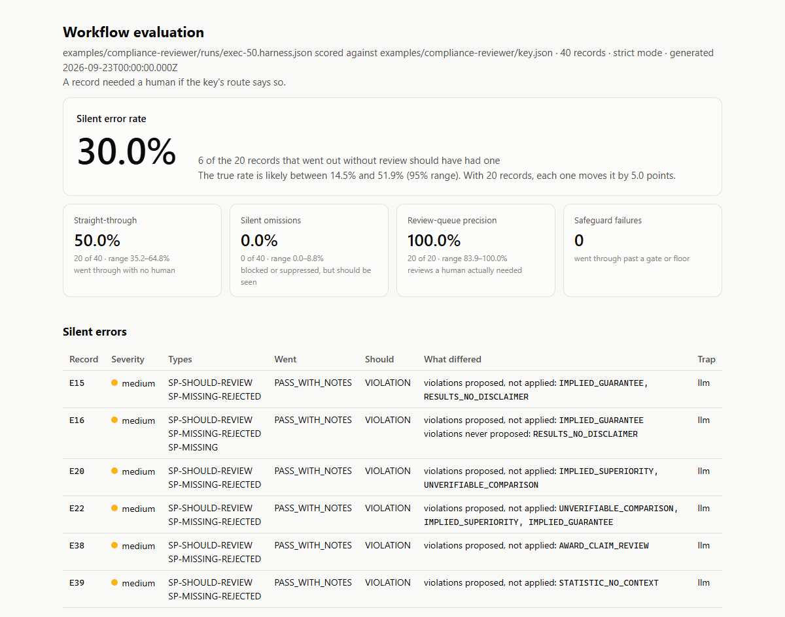

# workflow-eval-harness

[](https://github.com/DHuberPortfolio/workflow-eval-harness/actions/workflows/test.yml)

Measures an AI workflow against a golden set, with one number in front: the
**silent error rate**. That is the share of records the workflow let through with
no human in front of them that needed one. Those are the only errors that reach
anyone outside the building; everything else was caught by a person or a guard.

## What it found in two real workflows

Both are AI workflows built in n8n, each with its own golden set. The harness reads
their exports through a config, the same way it reads a Zapier export, a script's log,
an API response or a spreadsheet.

**A compliance reviewer for law-firm advertising.** A regex layer catches banned words;
an LLM catches implied violations, and its finding holds the copy for review only when its
confidence clears the client's threshold. Below the threshold, the finding becomes a note
and the copy goes live. The workflow's own scorecard counted a note as a catch, and
reported a 100% catch rate.

The harness counted what went live without a person: **6 of the 20 documents (30%)
needed one**, and 22-30% across three runs of identical code. Every one was a violation
the model had found and then stated below the threshold (0.55-0.85 against 0.80-0.90).
So the fix belonged in the model, not the threshold. A prompt change that anchors what each
confidence level means brought it to **6.7% in all four runs**, a drop well beyond the
old prompt's run-to-run noise: 5 routes fixed, none broken, no new false alarms on clean
copy. ([notes](examples/compliance-reviewer/NOTES.md))

The same runs showed the answer key was incomplete. The new prompt named real violations
the key had never listed, so it looked 10-20 points less precise than it was. The harness
lists every value a model states in every run that the key lacks, for a person to rule on
(the same mistake can repeat every run too); 9 of the 25 went into the key.
([review](examples/compliance-reviewer/KEY_GAPS.md))

**A news-metadata tagger** (24 articles, controlled-vocabulary codes on four facets). The
harness reproduces the workflow's own scorecard figure for figure. Three fresh runs found
0 silent errors in 23 auto-published articles, and the harness says what that is worth: a
true rate up to 14% is still consistent with it, where one run's "0 of 7" allows up to 35%.
([notes](examples/metadata-enrichment/NOTES.md))



Open the full reports, each one self-contained HTML file: the compliance reviewer
[before](https://dhuberportfolio.github.io/workflow-eval-harness/samples/compliance-before.html) and
[after](https://dhuberportfolio.github.io/workflow-eval-harness/samples/compliance-after.html) its prompt fix.

## Try it

```
node bin/wfeval.js score --config test/fixtures/tiny/config.json \
  --pred test/fixtures/tiny/predictions.json --key test/fixtures/tiny/key.json
```

```
HEADLINE
                             rate         count   95% range
  Silent error rate         50.0%        1 of 2   9.5-90.5%
  Straight-through          33.3%        2 of 6   9.7-70.0%
  Silent omissions           0.0%        0 of 4   0.0-49.0%
  Review-queue precision    50.0%        1 of 2   9.5-90.5%
  Block precision          100.0%        1 of 1   20.7-100.0%
  Safeguard failures                0 record(s)
  At this size one record moves the silent error rate by 50.0 points.

SILENT ERRORS  1 record(s)  (high 1)
  R2      high      SP-WRONG, SP-SHOULD-REVIEW   [plausible-extra-tag]
          went: AUTO_PUBLISH   should: EDITOR_REVIEW
          SUBJECT  applied, not in key: SUBJ-ANTI
```

Node 18.3 or later. No dependencies, no network, no API key. The same results can be
written as JSON (`--json`) and as a self-contained HTML report (`--html`).

## What it does

| Command | Question it answers |
|---|---|
| `wfeval score` | How did this run do? Silent errors by type and severity, routing, output quality, per-trap results, calibration. `--fail-on critical` exits non-zero for CI. |
| `wfeval variance` | How much do the numbers move between runs of identical code? Mean, spread and range per metric, the records that behave differently run to run, and possible key gaps: values stated in every run that the key does not list, for a person to rule on. |
| `wfeval compare` | Did a change help, or did it move within that noise? Every metric's change against the noise range of repeated runs, and every record that was fixed or broken. |
| `wfeval whatif` | What would the numbers be at another threshold? Sweeps the auto-publish gate or the value floor. |
| `wfeval check` | Is this config, and this pair of files, readable? Prints what it understood. |

It is not tied to any platform. The config says where the records are and what their
fields are called: an n8n export, a script's JSON Lines log, an API response, a
spreadsheet. `test/fixtures/shapes/` holds the same six records in six shapes, and the
tests require all of them to load identically.

## The metrics, and why each exists

**Silent error rate** (the headline). Of the records that went straight through, the
share that needed a human. A record "needed a human" if the answer key's correct route
says so, or if its values are wrong (`wrong_when` chooses; see below). Every silent error
is typed and given a severity (docs/SILENT_ERRORS.md): "should have been blocked" is
critical, "a correct value the floor threw away" is medium. The overall rate cannot say
which kind of mistake is getting through; the types can.

**Every rate carries its 95% range.** 0 silent errors in 7 auto-published records looks
perfect and is consistent with a true rate as high as 35%. A bare percentage hides
whether it came from 7 records or 700; the range (a Wilson score interval, chosen because
the textbook formula claims a range of exactly 0 to 0 at 0/7) makes it visible. The
report also says how far one record moves the rate at this size.

**Straight-through** (went through / all records). The throughput number. Meaningless
alone: sending everything through scores 100%. It only means something beside the
silent error rate.

**Silent omissions.** The other direction: records blocked or suppressed as duplicates
that the key says should have gone through or to a person. Nobody sees them either.

**Review-queue precision.** Of the records sent to a person, the share that needed one.
A queue full of records nobody changes teaches reviewers to rubber-stamp, and then the
review protects nothing.

**Block precision.** Of the records blocked, the share the key also blocks.

**Safeguard failures.** Records that went through although the workflow's own gate or
floor should have held them. Reported beside the silent error rate, not inside it: the
content may happen to be right, but the next record through the same hole may not be.

**Precision, recall, F1** per output, per value and overall; for labels, accuracy,
per-label scores and a confusion matrix. Only applied values count as predicted.
For ordered labels (a 1-5 band), how far off each miss was: within one step, average
distance, whether scores lean high or low, and a closeness score where a near miss loses a
little and a miss across the scale loses everything. A near miss that goes out is a
low-severity silent error; a far miss is a high one.
Duplicates and records whose model call failed are left out, and named.

**Per trap.** A golden set is built from traps: records designed to provoke a specific
failure. Grouping results by the key's trap labels shows which kind of trap gets
through, which a single rate hides. With `min_per_trap`, a trap type with too few
records stops the run: one record passing a trap can be luck.

**Calibration.** Does a stated confidence mean what it says? If the gate is 0.85, are
claims stated at 0.85 right 85% of the time? Claims are grouped by stated value (models
favour round numbers, so a fixed 0.1-wide bucket would blur exactly the values that
matter) and each group's accuracy is compared with what was stated. The config's own
thresholds are checked too: how often were values below the floor actually right?

**Variance and compare.** Identical code can produce different numbers from run to run;
one run cannot claim more precision than that spread. `compare` judges every change
against the range of repeated runs and says "within noise" or "beyond noise".

**What-if.** A threshold change can only move a record whose route the confidence gate
decided, so the what-if moves only those (named by `whatif.movable_field`; without it,
it assumes every auto or review record is movable and says so). At the current
threshold it must reproduce the actual routes, or it reports that its assumption is
wrong. It shows the silent error count beside the rate, because a rate can fall only
because correct records joined the denominator.

## Architecture

```
config.json ──> config.js ──┐
                            ▼
predictions ──> load.js ──> align.js ──> judge.js ──> routing.js ─────┐
answer key  ──>  (csv.js)   (pairs by id)  (one judgment   classification.js │──> results ──> terminal / JSON / HTML
                                            per record)    traps.js          │
                                                           calibration.js ───┘
                                           variance · compare · whatif reuse the same judgments
```

- **Messy input is handled in one place.** `load.js` (and `csv.js` for spreadsheets) is
  the only code that reads files. After it, every id is trimmed text, every confidence
  is a number or null, every `applied` a real true/false. Nothing downstream re-checks.
- **Pairs, never totals.** `align.js` pairs each prediction with its answer by id.
  Totals can match while records do not: two misroutes in opposite directions cancel.
- **One judgment per record.** `judge.js` decides, once, whether each record needed a
  human, which error types apply and which safeguards failed. Every number, the per-trap
  table and the what-ifs are counts over these judgments, so they cannot disagree.
- **Metrics are pure functions.** Records in, numbers out; no files, no printing. That
  is what makes them testable with a few lines of data.
- **One results object, three renderings.** Terminal, JSON and HTML all draw from it.
- **The core knows no workflow.** Anything specific to one workflow lives in
  `examples/<workflow>/`: its config and, when its export needs restructuring rather
  than locating, a small adapter.

## It refuses to guess

An evaluation tool that quietly miscounts is worse than none. Every way the harness
itself could compute a wrong number is listed in `test/TRAPS.md` (80+ of them), with
what the tool does about each:

- **Stop** and name every offending record: a record in the key that never came out of
  the workflow; `"applied": "false"` as text (in JavaScript, the text "false" counts as
  true); a confidence of `85` or `"0.9"`; a route name with the wrong case; a CSV with a
  decimal comma.
- **Fix, and report it**: stray spaces, the invisible marker Windows puts at the start of files.
- **Rules** the arithmetic must follow: 0 / 0 is "nothing to measure", not 0%; F1 from
  counts, never from rounded percentages; 0.7 goes in the 0.7-0.8 bucket even though
  0.7 / 0.1 is 6.9999… in binary.

**Strict mode** (the default, for golden sets) stops on anything suspicious, because
there it is a bug to find. `--lenient` (for samples of production output) turns those
into warnings. A record that went in and never came out stops the run in both modes.

## Testing

`npm test` runs 170+ tests with Node's built-in runner. On every push, GitHub Actions
runs them on Linux and Windows with Node 18, 22 and 24, runs the commands this README and
the example notes show, checks that `--fail-on high` stops a build with a high-severity
silent error, and rebuilds the sample reports (`node scripts/build-samples.js`), failing if
they differ from the committed copies.

The metric tests are checked against answers worked out by hand before the code existed:

- `test/fixtures/tiny/`: six tagged records, each built to test one case. `EXPECTED.md`
  shows every number's working.
- `test/fixtures/compliance/`: nine documents from a compliance reviewer, as spreadsheets,
  with a verdict label that is also the route.
- `test/fixtures/runs/`: three runs of the same workflow, for variance and compare.
- `examples/metadata-enrichment/`: a real run. Through a small adapter, the harness
  reproduces that workflow's own scorecard figure for figure (straight-through 7/24,
  silent errors 0/7, review-queue precision 14/15, every facet's precision, recall and F1),
  and three fresh runs (61-63) for variance.
- `examples/compliance-reviewer/`: seven real runs, before and after a prompt change, with
  the answer key review that followed.

The tests were checked for teeth by breaking the code on purpose (swapping precision and
recall, ignoring `key_field`, weakening the "record never came out" stop) and confirming
a test fails each time.

## Configuring a workflow

See `docs/CONFIG.md`. A minimal config:

```json
{
  "outputs": { "tags": { "type": "set" } },
  "routing": {
    "field": "decision",
    "gold_field": "expected_decision",
    "map": { "AUTO_PUBLISH": "auto", "REVIEW": "review" }
  },
  "thresholds": { "floor": 0.6, "auto_publish": { "tags": 0.85 } }
}
```

## Limits

- Scores sets of values, single labels and ordered labels. Free text is not supported:
  it needs a reviewer to grade each field first, and the grades can then be scored as labels.
- The floor what-if does not re-add broader terms or re-apply per-output caps; records
  whose route could depend on those are marked "needs replay" rather than guessed.
- Calibration and every rate are only as strong as the golden set is large. The ranges
  say how strong that is.

MIT licence.
