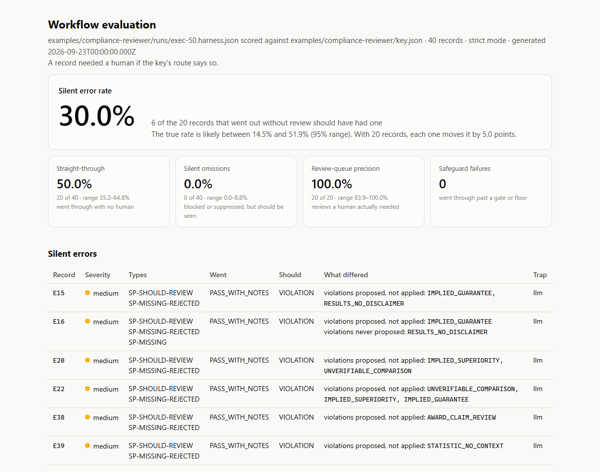

# workflow-eval-harness

[](https://github.com/DHuberPortfolio/workflow-eval-harness/actions/workflows/test.yml)

Measures an AI workflow against a golden set (test records with an answer key), with one
number in front: the **silent error rate**. Of the records the workflow sent out without
anyone reviewing them, the share that needed a person. Those are the only mistakes that
reach the outside world unseen; every other mistake was caught by a person or a guard.

## What it found in two real workflows

Both are AI workflows built in n8n. Each was scored first on a small golden set, then on a
500-record golden set built to cover its traps. The harness reads their exports through a
config, the same way it reads a Zapier export, a script's log, an API response or a spreadsheet.

**A compliance reviewer for law-firm advertising.** A regex layer catches banned words; an
LLM catches implied violations, and holds the copy for a person only when its confidence
clears the client's threshold. Below the threshold, the finding becomes a note and the copy
goes out without review. The workflow's own scorecard counted a note as a catch, and
reported a 100% catch rate.

On its first 40 documents, the harness counted what went out without review: 20, and
**6 of them (30%) needed a person**. In every one, the model had found the violation and then
stated its confidence below the threshold. So the fix belonged in the model, not the
threshold: a prompt that anchors what each confidence level means brought it to 6.7% in four
runs out of four, a drop well beyond the old prompt's run-to-run noise. The workflow's
scorecard now reports the silent error rate too.

On 500 documents (243 violations; 257 clean, 112 of them built to look like violations) the
silent error rate is **9.8%** (25 of 256; likely 6.7-14.0%), with 89.7% of violations reaching
a person. The larger set shows where the rest is: 15 of the 25 silent errors are award claims
("Named to Super Lawyers"), which the model rates 0.75 almost every time, under every client's
threshold; and 23 of the 26 clean documents sent to a person anyway were flagged by regex
rules that cannot read context (a fee counted as a result, "We cannot guarantee" read as a
guarantee). ([notes](examples/compliance-reviewer/NOTES.md))

The same runs showed the answer key was incomplete: the new prompt named real violations the
answer key had never listed. The harness lists every value a model states in every run that
the answer key lacks, for a person to rule on (the same mistake can repeat every run too).
([review](examples/compliance-reviewer/KEY_GAPS.md))

**A news-metadata tagger** (controlled-vocabulary codes on four facets). On 24 articles,
three runs found 0 silent errors in the 23 that went out without review, which the harness
said still allowed a true rate up to 14%. On 500 articles it was **27%**. The small set was
not representative, and a likely range only covers chance, not an unrepresentative golden set.

Two prompt fixes and a new guard (a tag the model proposed but set aside goes to an editor)
brought it to **7.1% across three runs of identical code** (6.3%, 6.5%, 8.6%; pooled 44 of
615, likely 5.4-9.5%), a drop beyond run-to-run noise. On the half of the articles the
guard's threshold was not tuned on, it is 6.6%. The price: 41% of articles now go out without
review, down from 47%, and more than half of the reviews are ones an editor did not need.
([notes](examples/metadata-enrichment/NOTES.md))



Open the full reports, each one self-contained HTML file: the compliance reviewer
[before](https://dhuberportfolio.github.io/workflow-eval-harness/samples/compliance-before.html) and
[after](https://dhuberportfolio.github.io/workflow-eval-harness/samples/compliance-after.html) its prompt fix on 40 documents,
and both workflows on 500 records:
[compliance reviewer](https://dhuberportfolio.github.io/workflow-eval-harness/samples/compliance-golden500.html),
[metadata tagger](https://dhuberportfolio.github.io/workflow-eval-harness/samples/metadata-golden500.html).

## Why a harness, if you already have a golden set?

The golden set is the exam and its answer key; the harness is the grader. A golden set says
nothing until something marks it, and the marking is where the two workflows above went wrong.

1. **The workflow graded its own exam.** The compliance reviewer had a golden set and its own
   scorecard, which reported a 100% catch rate because it counted "went out with a note" as
   caught. The harness counted what actually happened: 30% of the copy that went out unseen
   needed a person.
2. **It counts the mistakes that matter.** In the metadata tagger's first 500-article run, 99%
   of the tags it applied were correct, yet 27% of the articles it published without review
   had an error. An average hides that; the silent error rate does not.
3. **It says how far to trust a number.** "0 errors in 23" looked perfect; the real rate was
   27%. Three identical runs gave 6.3%, 6.5% and 8.6%. Likely ranges and repeated runs tell a
   real improvement from luck, and `compare` says whether a change is beyond noise.
4. **It says why, not just how often.** The model had found the violations and understated its
   confidence, so the fix was the prompt, not the threshold. 15 of 25 misses were award claims.
   Regex rules, not the AI, caused most unnecessary reviews. A pass/fail count points at none
   of that.
5. **It answers "what if" for free.** Capping thresholds at 0.85 and sending award claims to a
   person: 1.3%, computed from the recorded answers without running the workflow again.
6. **It checks the answer key too.** It surfaced 9 real violations the compliance answer key
   had missed, and it stops rather than count anything it cannot read correctly.
7. **One yardstick for every workflow.** Each workflow's home-made scorecard measures in its own
   way. The harness measures n8n, Zapier or custom-code workflows identically, on every change,
   and `--fail-on` can stop a build that lets a serious error through.

If a workflow never decides what goes out unseen, rarely changes, and all you need is how many
it got right, a spreadsheet is enough. The harness earns its keep when a workflow decides what
goes out without review, keeps changing, and has to be trusted.

## Try it

Node 18.3 or later. No dependencies, no network, no API key.

```
node bin/wfeval.js score --config test/fixtures/tiny/config.json \
  --pred test/fixtures/tiny/predictions.json --key test/fixtures/tiny/key.json
```

```
HEADLINE
                         rate         count   likely range   what it counts
  Silent error rate     50.0%        1 of 2   9.5-90.5%      went out without review, but needed a person
  Straight-through      33.3%        2 of 6   9.7-70.0%      went out without review
  Silent omissions       0.0%        0 of 4   0.0-49.0%      blocked or suppressed, but should have gone out or to a person
  Review precision      50.0%        1 of 2   9.5-90.5%      sent to a person, and needed one
  Block precision      100.0%        1 of 1   20.7-100.0%    blocked, and the answer key agrees
  Safeguard failures            0 record(s)                  went out past the workflow's own confidence gate or floor
  The likely range is where the true rate probably sits (95%). With 2 records out without review, each one moves the silent error rate by 50.0 points.

SILENT ERRORS  1 record(s)  (high 1): went out without review, but needed a person
  R2      high      SP-WRONG, SP-SHOULD-REVIEW   [plausible-extra-tag]
          went: AUTO_PUBLISH   answer key: EDITOR_REVIEW
          SUBJECT  applied, not in the answer key: SUBJ-ANTI
  what the types mean
    SP-WRONG           a wrong value went out
    SP-SHOULD-REVIEW   went out, but should have gone to a person
```

Add `--html report.html` for the report shown above, or `--json results.json` for the same
numbers as data. [How to read a report](docs/READING_A_REPORT.md) walks through one, number
by number.

## What it does

| Command | Question it answers |
|---|---|
| `wfeval score` | How did this run do? Silent errors by type and severity, routing, output quality, per-trap results, calibration. `--fail-on critical` exits non-zero, to stop a build. |
| `wfeval variance` | How much do the numbers move between runs of identical code? Mean, spread and range per metric, the records that behave differently run to run, and possible key gaps: values stated in every run that the answer key does not list, for a person to rule on. |
| `wfeval compare` | Did a change help, or did it move within that noise? Every metric's change against the spread of repeated runs, and every record that was fixed or broken. |
| `wfeval whatif` | What would the numbers be at another threshold? Sweeps the confidence gate or the confidence floor. |
| `wfeval check` | Is this config, and this pair of files, readable? Prints what it understood. |

It is not tied to any platform. The config says where the records are and what their
fields are called: an n8n export, a Zapier export, a script's JSON Lines log, an API
response, a spreadsheet.

## Using it on your own workflow

1. Export one run of the workflow on its golden set, with the answer key (in the same file or
   a separate one).
2. Write a config saying where the records and their fields are, and which of the
   workflow's decisions mean "went out without review", "sent to a person", "blocked" and
   "suppressed as a duplicate". A minimal one:

   ```json
   {
     "outputs": { "tags": { "type": "set" } },
     "routing": {
       "field": "decision",
       "gold_field": "expected_decision",
       "map": { "AUTO_PUBLISH": "auto", "REVIEW": "review" }
     },
     "thresholds": { "floor": 0.6, "auto_publish": { "tags": 0.85 } }
   }
   ```
3. `wfeval check` until it reads everything the way you mean, then `wfeval score`.

Every config option: [docs/CONFIG.md](docs/CONFIG.md). The two real workflows in
[`examples/`](examples) show complete configs.

## Built not to miscount

An evaluation tool that quietly miscounts is worse than none. Every way the harness itself
could compute a wrong number is listed in [`test/TRAPS.md`](test/TRAPS.md) (80+ of them),
with what it does about each: stop and name the offending record, fix and report it, or
follow a stated rule. On a golden set it stops on anything suspicious; `--lenient` turns
those stops into warnings for samples of production output.

170+ tests check the numbers against answers worked out by hand before the code existed.
GitHub Actions runs them on Linux and Windows with Node 18, 22 and 24 on every push, along
with the commands this README shows, and checks that the sample reports match what the tool
produces today. Details: [docs/ARCHITECTURE.md](docs/ARCHITECTURE.md).

## Limits

- Scores sets of values, single labels and ordered labels. Free text is not supported:
  it needs a reviewer to grade each field first, and the grades can then be scored as labels.
- The floor what-if does not re-add broader terms or re-apply per-output caps; records
  whose route could depend on those are marked "needs replay" rather than guessed.
- Every rate is only as strong as the golden set is large. The likely ranges say how strong
  that is.

## Docs

| | |
|---|---|
| [How to read a report](docs/READING_A_REPORT.md) | The words used, and every number in a report, top to bottom |
| [The metrics](docs/METRICS.md) | What each number measures, and why it exists |
| [Silent errors](docs/SILENT_ERRORS.md) | Every error type, how it is detected, and its severity |
| [Config](docs/CONFIG.md) | Every config option |
| [How it is built](docs/ARCHITECTURE.md) | Architecture, the refuse-to-guess rules, testing |

MIT licence.
